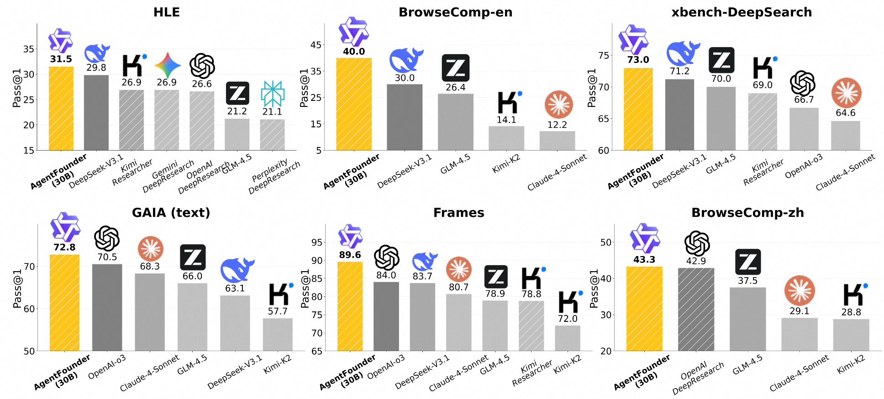
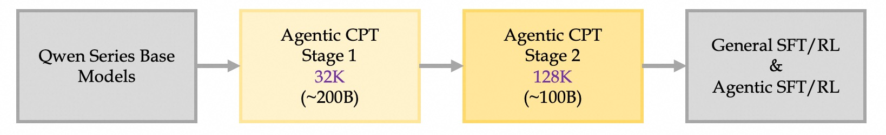
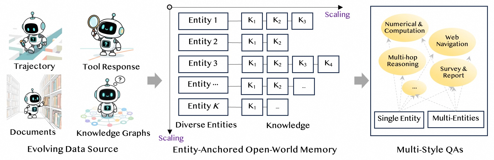
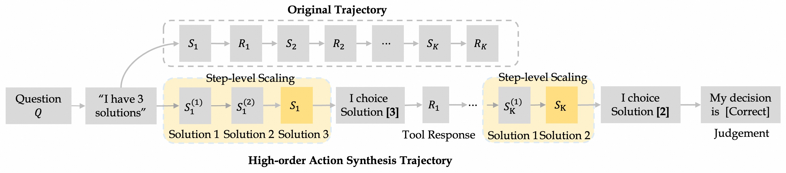

#  Scaling Deep Research Agents via Continual Pre-training 🚀

This work is **the first** to bring Agentic Continual Pretraining (**Agentic CPT**) into the training pipeline of Deep Research Agents, resulting in the powerful agentic model ACT-30B-A3B ⚡️.

<p align="center">
  
</p>

🌟 Beyond standard post-training, we propose a systematic **agentic training data synthesis method** for Agentic CPT, and design a **two-stage continual pre-training strategy** (as illustrated below):  

<p align="center">
  
</p>

<!-- --- -->

## ✨ Features  

### 🧩 Agentic Training Pipeline  
We redesign the training pipeline of deep research agents by introducing continual pre-training with context lengths of **32K** and **128K**. This design ensures both training efficiency and improved performance, enabling the agent to effectively handle increasingly complex research tasks.  

### 🧠 Scaling Training Contexts based on Open-World Memory  
We transform continuously updated data streams into an open-world memory, enabling the synthesis of diverse QA styles.

<p align="center">
  
</p>


### 📝 FAS — Planning Action Synthesis
Building on the strong correlation between initial planning and trajectory's accuracy, we generate a large number of reasoning–action data from diverse QA instances to strengthen the agent’s planning capability. 


### 💡 FAS — Answer Action Synthesis 
By combining questions with their knowledge sources, we emulate the process of deriving final answers through logical inference under fully informed conditions, strengthening the agent’s reasoning capability.

### 🔗 HAS — Multi-Decision Answer Action Synthesis 
We reformulate the agent trajectories as **multi-step decision-making processes**, fully exploring the **reasoning–action space** at each step. HAS expands the agent’s capacity to explore the action–answer space while enhancing its decision-making abilities.

<p align="center">
  
</p>


## 🏆 High-light Performance

**General Web Search Benchmarks**
<table style="border-collapse:collapse;width:100%;font-family:system-ui,Segoe UI,Arial,sans-serif;font-size:14px;">
  <thead>
    <tr>
      <th style="border:1px solid #ddd;padding:8px;background:#fafafa;text-align:left;">Backbone</th>
      <th style="border:1px solid #ddd;padding:8px;background:#fafafa;">BrowseComp-en</th>
      <th style="border:1px solid #ddd;padding:8px;background:#fafafa;">BrowseComp-zh</th>
      <th style="border:1px solid #ddd;padding:8px;background:#fafafa;">GAIA</th>
      <th style="border:1px solid #ddd;padding:8px;background:#fafafa;">Xbench-DeepSearch</th>
      <th style="border:1px solid #ddd;padding:8px;background:#fafafa;">WebwalkerQA</th>
    </tr>
  </thead>
  <tbody>
    <!-- General LLMs with tools -->
    <tr>
      <td colspan="6" style="border:1px solid #ddd;padding:6px;background:#e5e5fc;font-style:italic;font-weight:700;text-align:center;">
        General LLMs with tools
      </td>
    </tr>
    <tr>
      <td style="border:1px solid #ddd;padding:8px;">Qwen3-30B-A3B</td>
      <td style="border:1px solid #ddd;padding:8px;text-align:center;">0.5</td>
      <td style="border:1px solid #ddd;padding:8px;text-align:center;">13.5</td>
      <td style="border:1px solid #ddd;padding:8px;text-align:center;">35.9</td>
      <td style="border:1px solid #ddd;padding:8px;text-align:center;">32.0</td>
      <td style="border:1px solid #ddd;padding:8px;text-align:center;">46.9</td>
    </tr>
    <tr>
      <td style="border:1px solid #ddd;padding:8px;">Qwen3-235B-A22B</td>
      <td style="border:1px solid #ddd;padding:8px;text-align:center;">2.3</td>
      <td style="border:1px solid #ddd;padding:8px;text-align:center;">29.4</td>
      <td style="border:1px solid #ddd;padding:8px;text-align:center;">45.6</td>
      <td style="border:1px solid #ddd;padding:8px;text-align:center;">46.0</td>
      <td style="border:1px solid #ddd;padding:8px;text-align:center;">59.6</td>
    </tr>
    <tr>
      <td style="border:1px solid #ddd;padding:8px;">DeepSeek-R1</td>
      <td style="border:1px solid #ddd;padding:8px;text-align:center;">8.9†</td>
      <td style="border:1px solid #ddd;padding:8px;text-align:center;">35.7†</td>
      <td style="border:1px solid #ddd;padding:8px;text-align:center;">–</td>
      <td style="border:1px solid #ddd;padding:8px;text-align:center;">55.0†</td>
      <td style="border:1px solid #ddd;padding:8px;text-align:center;">–</td>
    </tr>
    <tr>
      <td style="border:1px solid #ddd;padding:8px;">Claude-4-Sonnet</td>
      <td style="border:1px solid #ddd;padding:8px;text-align:center;">12.2†</td>
      <td style="border:1px solid #ddd;padding:8px;text-align:center;">29.1†</td>
      <td style="border:1px solid #ddd;padding:8px;text-align:center;">68.3†</td>
      <td style="border:1px solid #ddd;padding:8px;text-align:center;">64.6†</td>
      <td style="border:1px solid #ddd;padding:8px;text-align:center;">61.7†</td>
    </tr>
    <!-- Commercial Deep Research Agents -->
    <tr>
      <td colspan="6" style="border:1px solid #ddd;padding:6px;background:#e5e5fc;font-style:italic;font-weight:700;text-align:center;">
        Commercial Deep Research Agents
      </td>
    </tr>
    <tr>
      <td style="border:1px solid #ddd;padding:8px;">Kimi-Researcher</td>
      <td style="border:1px solid #ddd;padding:8px;text-align:center;">–</td>
      <td style="border:1px solid #ddd;padding:8px;text-align:center;">–</td>
      <td style="border:1px solid #ddd;padding:8px;text-align:center;">–</td>
      <td style="border:1px solid #ddd;padding:8px;text-align:center;">69.0†</td>
      <td style="border:1px solid #ddd;padding:8px;text-align:center;">–</td>
    </tr>
    <tr>
      <td style="border:1px solid #ddd;padding:8px;">OpenAI-o3</td>
      <td style="border:1px solid #ddd;padding:8px;text-align:center;">49.7†</td>
      <td style="border:1px solid #ddd;padding:8px;text-align:center;">58.1†</td>
      <td style="border:1px solid #ddd;padding:8px;text-align:center;">70.5†</td>
      <td style="border:1px solid #ddd;padding:8px;text-align:center;">66.7†</td>
      <td style="border:1px solid #ddd;padding:8px;text-align:center;">71.7†</td>
    </tr>
    <tr>
      <td style="border:1px solid #ddd;padding:8px;">OpenAI Deep Research</td>
      <td style="border:1px solid #ddd;padding:8px;text-align:center;">51.5†</td>
      <td style="border:1px solid #ddd;padding:8px;text-align:center;">–</td>
      <td style="border:1px solid #ddd;padding:8px;text-align:center;">67.0†</td>
      <td style="border:1px solid #ddd;padding:8px;text-align:center;">–</td>
      <td style="border:1px solid #ddd;padding:8px;text-align:center;">–</td>
    </tr>
    <!-- Open-source Deep Research Agents -->
    <tr>
      <td colspan="6" style="border:1px solid #ddd;padding:6px;background:#e5e5fc;font-style:italic;font-weight:700;text-align:center;">
        Open-source Deep Research Agents
      </td>
    </tr>
    <tr>
      <td style="border:1px solid #ddd;padding:8px;">WebThinker-32B-RL</td>
      <td style="border:1px solid #ddd;padding:8px;text-align:center;">2.8†</td>
      <td style="border:1px solid #ddd;padding:8px;text-align:center;">7.3†</td>
      <td style="border:1px solid #ddd;padding:8px;text-align:center;">48.5†</td>
      <td style="border:1px solid #ddd;padding:8px;text-align:center;">24.0†</td>
      <td style="border:1px solid #ddd;padding:8px;text-align:center;">46.5†</td>
    </tr>
    <tr>
      <td style="border:1px solid #ddd;padding:8px;">ASearcher-Web-QwQ</td>
      <td style="border:1px solid #ddd;padding:8px;text-align:center;">5.2†</td>
      <td style="border:1px solid #ddd;padding:8px;text-align:center;">15.6†</td>
      <td style="border:1px solid #ddd;padding:8px;text-align:center;">52.8†</td>
      <td style="border:1px solid #ddd;padding:8px;text-align:center;">42.1†</td>
      <td style="border:1px solid #ddd;padding:8px;text-align:center;">34.3†</td>
    </tr>
    <tr>
      <td style="border:1px solid #ddd;padding:8px;">WebSailor-72B</td>
      <td style="border:1px solid #ddd;padding:8px;text-align:center;">12.0†</td>
      <td style="border:1px solid #ddd;padding:8px;text-align:center;">30.1†</td>
      <td style="border:1px solid #ddd;padding:8px;text-align:center;">55.4†</td>
      <td style="border:1px solid #ddd;padding:8px;text-align:center;">55.0†</td>
      <td style="border:1px solid #ddd;padding:8px;text-align:center;">–</td>
    </tr>
    <tr>
      <td style="border:1px solid #ddd;padding:8px;">WebShaper-72B</td>
      <td style="border:1px solid #ddd;padding:8px;text-align:center;">–</td>
      <td style="border:1px solid #ddd;padding:8px;text-align:center;">–</td>
      <td style="border:1px solid #ddd;padding:8px;text-align:center;">60.1†</td>
      <td style="border:1px solid #ddd;padding:8px;text-align:center;">–</td>
      <td style="border:1px solid #ddd;padding:8px;text-align:center;">52.2†</td>
    </tr>
    <tr>
      <td style="border:1px solid #ddd;padding:8px;">AFM-32B-RL</td>
      <td style="border:1px solid #ddd;padding:8px;text-align:center;">11.1†</td>
      <td style="border:1px solid #ddd;padding:8px;text-align:center;">–</td>
      <td style="border:1px solid #ddd;padding:8px;text-align:center;">55.3†</td>
      <td style="border:1px solid #ddd;padding:8px;text-align:center;">63.0†</td>
      <td style="border:1px solid #ddd;padding:8px;text-align:center;">–</td>
    </tr>
    <tr>
      <td style="border:1px solid #ddd;padding:8px;">MiroThinker-32B-DPO<sub>v0.2</sub></td>
      <td style="border:1px solid #ddd;padding:8px;text-align:center;">17.2†</td>
      <td style="border:1px solid #ddd;padding:8px;text-align:center;">29.4†</td>
      <td style="border:1px solid #ddd;padding:8px;text-align:center;">64.1†</td>
      <td style="border:1px solid #ddd;padding:8px;text-align:center;">56.0†</td>
      <td style="border:1px solid #ddd;padding:8px;text-align:center;">53.6†</td>
    </tr>
    <tr>
      <td style="border:1px solid #ddd;padding:8px;">DeepDiver-V2-38B</td>
      <td style="border:1px solid #ddd;padding:8px;text-align:center;">13.4†</td>
      <td style="border:1px solid #ddd;padding:8px;text-align:center;">34.6†</td>
      <td style="border:1px solid #ddd;padding:8px;text-align:center;">–</td>
      <td style="border:1px solid #ddd;padding:8px;text-align:center;">53.0†</td>
      <td style="border:1px solid #ddd;padding:8px;text-align:center;">–</td>
    </tr>
    <tr>
      <td style="border:1px solid #ddd;padding:8px;">WebExplorer-8B</td>
      <td style="border:1px solid #ddd;padding:8px;text-align:center;">15.7†</td>
      <td style="border:1px solid #ddd;padding:8px;text-align:center;">32.0†</td>
      <td style="border:1px solid #ddd;padding:8px;text-align:center;">50.0†</td>
      <td style="border:1px solid #ddd;padding:8px;text-align:center;">53.7†</td>
      <td style="border:1px solid #ddd;padding:8px;text-align:center;">62.7†</td>
    </tr>
    <tr>
      <td style="border:1px solid #ddd;padding:8px;">DeepDive-32B</td>
      <td style="border:1px solid #ddd;padding:8px;text-align:center;">14.8†</td>
      <td style="border:1px solid #ddd;padding:8px;text-align:center;">25.6†</td>
      <td style="border:1px solid #ddd;padding:8px;text-align:center;">–</td>
      <td style="border:1px solid #ddd;padding:8px;text-align:center;">50.5†</td>
      <td style="border:1px solid #ddd;padding:8px;text-align:center;">–</td>
    </tr>
    <tr>
      <td style="border:1px solid #ddd;padding:8px;">Kimi-K2</td>
      <td style="border:1px solid #ddd;padding:8px;text-align:center;">14.1†</td>
      <td style="border:1px solid #ddd;padding:8px;text-align:center;">28.8†</td>
      <td style="border:1px solid #ddd;padding:8px;text-align:center;">57.3†</td>
      <td style="border:1px solid #ddd;padding:8px;text-align:center;">50.0†</td>
      <td style="border:1px solid #ddd;padding:8px;text-align:center;">63.0†</td>
    </tr>
    <tr>
      <td style="border:1px solid #ddd;padding:8px;">GLM-4.5</td>
      <td style="border:1px solid #ddd;padding:8px;text-align:center;">26.4†</td>
      <td style="border:1px solid #ddd;padding:8px;text-align:center;">37.5†</td>
      <td style="border:1px solid #ddd;padding:8px;text-align:center;">66.0†</td>
      <td style="border:1px solid #ddd;padding:8px;text-align:center;">70.0†</td>
      <td style="border:1px solid #ddd;padding:8px;text-align:center;">65.6†</td>
    </tr>
    <tr>
      <td style="border:1px solid #ddd;padding:8px;">DeepSeek-V3.1</td>
      <td style="border:1px solid #ddd;padding:8px;text-align:center;">30.0†</td>
      <td style="border:1px solid #ddd;padding:8px;text-align:center;">49.2†</td>
      <td style="border:1px solid #ddd;padding:8px;text-align:center;">63.1†</td>
      <td style="border:1px solid #ddd;padding:8px;text-align:center;">71.2†</td>
      <td style="border:1px solid #ddd;padding:8px;text-align:center;">61.2†</td>
    </tr>
    <!-- Ours -->
    <tr>
      <td colspan="6" style="border:1px solid #ddd;padding:6px;background:#e5e5fc;font-style:italic;font-weight:700;text-align:center;">
        Ours
      </td>
    </tr>
    <tr style="background:#fffaf0;">
      <td style="border:1px solid #ddd;padding:6px;text-align:center;font-weight:700">ACT-30B-A3B</td>
      <td style="border:1px solid #ddd;padding:6px;text-align:center;font-weight:700;text-align:center;">45.1</td>
      <td style="border:1px solid #ddd;padding:6px;text-align:center;font-weight:700;">49.8</td>
      <td style="border:1px solid #ddd;padding:6px;text-align:center;font-weight:700">72.8</td>
      <td style="border:1px solid #ddd;padding:6px;text-align:center;font-weight:700">74.0</td>
      <td style="border:1px solid #ddd;padding:6px;text-align:center;font-weight:700">73.8</td>
    </tr>
  </tbody>
</table>

**Scenario-targeted Web Search Benchmarks**

<table style="border-collapse:collapse;width:100%;font-family:system-ui,Segoe UI,Arial,sans-serif;font-size:14px;">
  <thead>
    <tr>
      <th style="border:1px solid #ddd;padding:6px;background:#fafafa;text-align:left;">Backbone</th>
      <th style="border:1px solid #ddd;padding:6px;background:#fafafa;">HLE<br><span style="font-weight:normal;">Pass@1</span></th>
      <th style="border:1px solid #ddd;padding:6px;background:#fafafa;">DeepResearch Bench<br><span style="font-weight:normal;">RACE Overall</span></th>
      <th style="border:1px solid #ddd;padding:6px;background:#fafafa;">Frames<br><span style="font-weight:normal;">Pass@1</span></th>
      <th style="border:1px solid #ddd;padding:6px;background:#fafafa;">SEAL-0<br><span style="font-weight:normal;">Pass@1</span></th>
      <th style="border:1px solid #ddd;padding:6px;background:#fafafa;">AcademicBrowse<br><span style="font-weight:normal;">Pass@1</span></th>
    </tr>
  </thead>
  <tbody>
    <!-- General LLMs with tools -->
    <tr>
      <td colspan="6" style="border:1px solid #ddd;padding:6px;background:#e5e5fc;font-style:italic;font-weight:700;text-align:center;">
        General LLMs with tools
      </td>
    </tr>
    <tr>
      <td style="border:1px solid #ddd;padding:6px;">Qwen3-30B-A3B</td>
      <td style="border:1px solid #ddd;padding:6px;text-align:center;">13.2</td>
      <td style="border:1px solid #ddd;padding:6px;text-align:center;">40.2</td>
      <td style="border:1px solid #ddd;padding:6px;text-align:center;">56.4</td>
      <td style="border:1px solid #ddd;padding:6px;text-align:center;">9.9</td>
      <td style="border:1px solid #ddd;padding:6px;text-align:center;">41.3</td>
    </tr>
    <tr>
      <td style="border:1px solid #ddd;padding:6px;">Qwen3-235B-A22B</td>
      <td style="border:1px solid #ddd;padding:6px;text-align:center;">20.0</td>
      <td style="border:1px solid #ddd;padding:6px;text-align:center;">44.8</td>
      <td style="border:1px solid #ddd;padding:6px;text-align:center;">–</td>
      <td style="border:1px solid #ddd;padding:6px;text-align:center;">14.4</td>
      <td style="border:1px solid #ddd;padding:6px;text-align:center;">50.7</td>
    </tr>
    <tr>
      <td style="border:1px solid #ddd;padding:6px;">DeepSeek-R1</td>
      <td style="border:1px solid #ddd;padding:6px;text-align:center;">24.8†</td>
      <td style="border:1px solid #ddd;padding:6px;text-align:center;">–</td>
      <td style="border:1px solid #ddd;padding:6px;text-align:center;">82.0†</td>
      <td style="border:1px solid #ddd;padding:6px;text-align:center;">29.7†</td>
      <td style="border:1px solid #ddd;padding:6px;text-align:center;">–</td>
    </tr>
    <tr>
      <td style="border:1px solid #ddd;padding:6px;">Claude-4-Sonnet</td>
      <td style="border:1px solid #ddd;padding:6px;text-align:center;">20.3†</td>
      <td style="border:1px solid #ddd;padding:6px;text-align:center;">–</td>
      <td style="border:1px solid #ddd;padding:6px;text-align:center;">80.7†</td>
      <td style="border:1px solid #ddd;padding:6px;text-align:center;">–</td>
      <td style="border:1px solid #ddd;padding:6px;text-align:center;">–</td>
    </tr>
    <!-- Commercial Deep Research Agents -->
    <tr>
      <td colspan="6" style="border:1px solid #ddd;padding:6px;background:#e5e5fc;font-style:italic;font-weight:700;text-align:center;">
        Commercial Deep Research Agents
      </td>
    </tr>
    <tr>
      <td style="border:1px solid #ddd;padding:6px;">Grok Deeper Search</td>
      <td style="border:1px solid #ddd;padding:6px;text-align:center;">–</td>
      <td style="border:1px solid #ddd;padding:6px;text-align:center;">38.2†</td>
      <td style="border:1px solid #ddd;padding:6px;text-align:center;">–</td>
      <td style="border:1px solid #ddd;padding:6px;text-align:center;">–</td>
      <td style="border:1px solid #ddd;padding:6px;text-align:center;">–</td>
    </tr>
    <tr>
      <td style="border:1px solid #ddd;padding:6px;">Perplexity Deep Research</td>
      <td style="border:1px solid #ddd;padding:6px;text-align:center;">21.1†</td>
      <td style="border:1px solid #ddd;padding:6px;text-align:center;">40.5†</td>
      <td style="border:1px solid #ddd;padding:6px;text-align:center;">–</td>
      <td style="border:1px solid #ddd;padding:6px;text-align:center;">–</td>
      <td style="border:1px solid #ddd;padding:6px;text-align:center;">–</td>
    </tr>
    <tr>
      <td style="border:1px solid #ddd;padding:6px;">Gemini Deep Research</td>
      <td style="border:1px solid #ddd;padding:6px;text-align:center;">26.9†</td>
      <td style="border:1px solid #ddd;padding:6px;text-align:center;">49.7†</td>
      <td style="border:1px solid #ddd;padding:6px;text-align:center;">–</td>
      <td style="border:1px solid #ddd;padding:6px;text-align:center;">–</td>
      <td style="border:1px solid #ddd;padding:6px;text-align:center;">–</td>
    </tr>
    <tr>
      <td style="border:1px solid #ddd;padding:6px;">Kimi-Researcher</td>
      <td style="border:1px solid #ddd;padding:6px;text-align:center;">26.9†</td>
      <td style="border:1px solid #ddd;padding:6px;text-align:center;">44.6†</td>
      <td style="border:1px solid #ddd;padding:6px;text-align:center;">78.8†</td>
      <td style="border:1px solid #ddd;padding:6px;text-align:center;">36.0†</td>
      <td style="border:1px solid #ddd;padding:6px;text-align:center;">–</td>
    </tr>
    <tr>
      <td style="border:1px solid #ddd;padding:6px;">OpenAI-o3</td>
      <td style="border:1px solid #ddd;padding:6px;text-align:center;">20.2†</td>
      <td style="border:1px solid #ddd;padding:6px;text-align:center;">–</td>
      <td style="border:1px solid #ddd;padding:6px;text-align:center;">84.0†</td>
      <td style="border:1px solid #ddd;padding:6px;text-align:center;">–</td>
      <td style="border:1px solid #ddd;padding:6px;text-align:center;">–</td>
    </tr>
    <tr>
      <td style="border:1px solid #ddd;padding:6px;">OpenAI Deep Research</td>
      <td style="border:1px solid #ddd;padding:6px;text-align:center;">26.6†</td>
      <td style="border:1px solid #ddd;padding:6px;text-align:center;">46.5†</td>
      <td style="border:1px solid #ddd;padding:6px;text-align:center;">–</td>
      <td style="border:1px solid #ddd;padding:6px;text-align:center;">–</td>
      <td style="border:1px solid #ddd;padding:6px;text-align:center;">–</td>
    </tr>
    <!-- Open-source Deep Research Agents -->
    <tr>
      <td colspan="6" style="border:1px solid #ddd;padding:6px;background:#e5e5fc;font-style:italic;font-weight:700;text-align:center;">
        Open-source Deep Research Agents
      </td>
    </tr>
    <tr>
      <td style="border:1px solid #ddd;padding:6px;">ASearcher-Web-QwQ</td>
      <td style="border:1px solid #ddd;padding:6px;text-align:center;">12.5†</td>
      <td style="border:1px solid #ddd;padding:6px;text-align:center;">–</td>
      <td style="border:1px solid #ddd;padding:6px;text-align:center;">70.9†</td>
      <td style="border:1px solid #ddd;padding:6px;text-align:center;">–</td>
      <td style="border:1px solid #ddd;padding:6px;text-align:center;">–</td>
    </tr>
    <tr>
      <td style="border:1px solid #ddd;padding:6px;">DeepDive-32B</td>
      <td style="border:1px solid #ddd;padding:6px;text-align:center;">–</td>
      <td style="border:1px solid #ddd;padding:6px;text-align:center;">–</td>
      <td style="border:1px solid #ddd;padding:6px;text-align:center;">76.1†</td>
      <td style="border:1px solid #ddd;padding:6px;text-align:center;">29.3†</td>
      <td style="border:1px solid #ddd;padding:6px;text-align:center;">–</td>
    </tr>
    <tr>
      <td style="border:1px solid #ddd;padding:6px;">MiroThinker-32B-DPO<sub>v0.2</sub></td>
      <td style="border:1px solid #ddd;padding:6px;text-align:center;">17.8†</td>
      <td style="border:1px solid #ddd;padding:6px;text-align:center;">–</td>
      <td style="border:1px solid #ddd;padding:6px;text-align:center;">74.8†</td>
      <td style="border:1px solid #ddd;padding:6px;text-align:center;">–</td>
      <td style="border:1px solid #ddd;padding:6px;text-align:center;">–</td>
    </tr>
    <tr>
      <td style="border:1px solid #ddd;padding:6px;">WebExplorer-8B</td>
      <td style="border:1px solid #ddd;padding:6px;text-align:center;">17.3†</td>
      <td style="border:1px solid #ddd;padding:6px;text-align:center;">–</td>
      <td style="border:1px solid #ddd;padding:6px;text-align:center;">75.7†</td>
      <td style="border:1px solid #ddd;padding:6px;text-align:center;">–</td>
      <td style="border:1px solid #ddd;padding:6px;text-align:center;">–</td>
    </tr>
    <tr>
      <td style="border:1px solid #ddd;padding:6px;">Kimi-K2</td>
      <td style="border:1px solid #ddd;padding:6px;text-align:center;">18.1†</td>
      <td style="border:1px solid #ddd;padding:6px;text-align:center;">25.4</td>
      <td style="border:1px solid #ddd;padding:6px;text-align:center;">72.0†</td>
      <td style="border:1px solid #ddd;padding:6px;text-align:center;">25.2</td>
      <td style="border:1px solid #ddd;padding:6px;text-align:center;">48.7</td>
    </tr>
    <tr>
      <td style="border:1px solid #ddd;padding:6px;">GLM-4.5</td>
      <td style="border:1px solid #ddd;padding:6px;text-align:center;">21.2†</td>
      <td style="border:1px solid #ddd;padding:6px;text-align:center;">39.2</td>
      <td style="border:1px solid #ddd;padding:6px;text-align:center;">78.9†</td>
      <td style="border:1px solid #ddd;padding:6px;text-align:center;">34.2</td>
      <td style="border:1px solid #ddd;padding:6px;text-align:center;">55.6</td>
    </tr>
    <tr>
      <td style="border:1px solid #ddd;padding:6px;">DeepSeek-V3.1</td>
      <td style="border:1px solid #ddd;padding:6px;text-align:center;">29.8†</td>
      <td style="border:1px solid #ddd;padding:6px;text-align:center;">35.4</td>
      <td style="border:1px solid #ddd;padding:6px;text-align:center;">83.7†</td>
      <td style="border:1px solid #ddd;padding:6px;text-align:center;">42.6†</td>
      <td style="border:1px solid #ddd;padding:6px;text-align:center;">65.0</td>
    </tr>
    <!-- Ours -->
    <tr>
      <td colspan="6" style="border:1px solid #ddd;padding:6px;background:#e5e5fc;font-style:italic;font-weight:700;text-align:center;">
        Ours
      </td>
    </tr>
    <tr style="background:#fffaf0;">
      <td style="border:1px solid #ddd;padding:6px;font-weight:700;">ACT-30B-A3B</td>
      <td style="border:1px solid #ddd;padding:6px;text-align:center;font-weight:700;">32.0</td>
      <td style="border:1px solid #ddd;padding:6px;text-align:center;font-weight:700;">49.0</td>
      <td style="border:1px solid #ddd;padding:6px;text-align:center;font-weight:700;">89.6</td>
      <td style="border:1px solid #ddd;padding:6px;text-align:center;font-weight:700;">46.9</td>
      <td style="border:1px solid #ddd;padding:6px;text-align:center;font-weight:700;">75.3</td>
    </tr>
  </tbody>
</table>

**Data Scaling**

<p align="center">
  
</p>

We are excited to observe that as the training data increases, ACT-30B-A3B achieves consistent improvements in average performance across multiple benchmarks, exhibiting characteristics of a potential scaling law.  


## 📚 Citation

If you find our work inspiring, please kindly cite as:

```bibtex
% Comming soon.
```