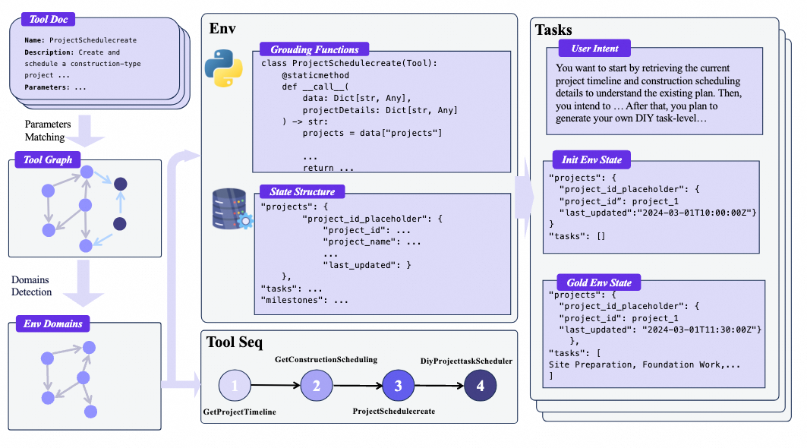
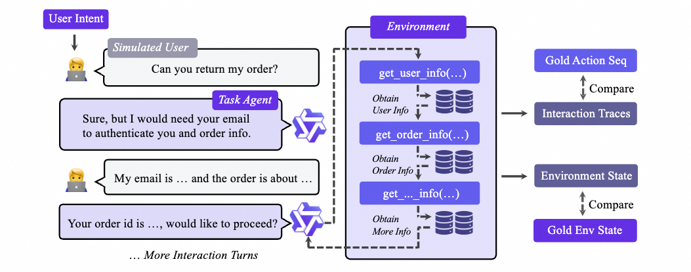
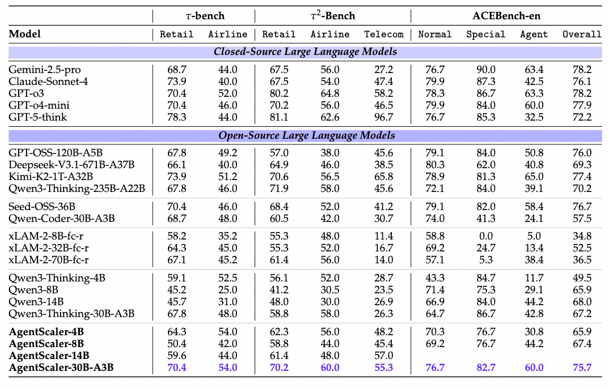

<h1 align="center"> AgentScaler: 

Towards General Agentic Intelligence via Environment Scaling</h1>


## 🌟Overview

In this work, we scale up environments as a step towards advancing general agentic intelligence. This gives rise to two central challenges: (i) how to scale environments in a principled manner, and (ii) how to effectively train agentic capabilities from experiences derived through inter-actions with these environments. To address these, we design a scalable framework that automatically constructs heterogeneous environments that are fully simulated, systematically broadening the space of function-calling scenarios. We further adapt a two-phase agent fine-tuning strategy: first endowing agentswith fundamental agentic capabilities, then specializing them for domain-specific contexts. Extensive experiments on agentic benchmarks, τ-bench, τ2-Bench, and ACEBench, demonstrate that our trained model, AgentScaler, significantly enhances the models’ function-calling capability.

## 🔧Framework
We introduce a principled pipeline that comprises two central stages: (i) fully simulated
environment construction and scaling, which establishes and expands diverse agentic scenarios, and (ii)
agent experience learning, which exploits these environments to foster generalizable intelligence.


The process to obtain the agent trajectories



## 📚MainResults
Main results on τ-bench, τ2-Bench, and ACEBench-en



## 🚩Citation

Please cite our repository if you think it's useful

```bibtex
@article{su2025agentfounder,
      title={Towards General Agentic Intelligence via Environment Scaling}, 
      author={Runnan Fang, Shihao Cai, Baixuan Li, Jialong Wu, Guangyu Li, Wenbiao Yin, Xinyu Wang, Xiaobin Wang, Liangcai Su, Zhen Zhang, Shibin Wu, Zhengwei Tao, Yong Jiang, Pengjun Xie, Fei Huang, Jingren Zhou},
      year={2025},
      journal={arXiv preprint arXiv:2509.13311},
}
```


## 🎉Contributors


We will offer long-term maintenance to fix bugs and solve issues. So if you have any problems, please put issues to us.