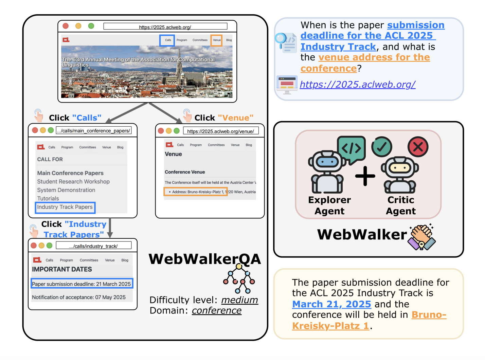
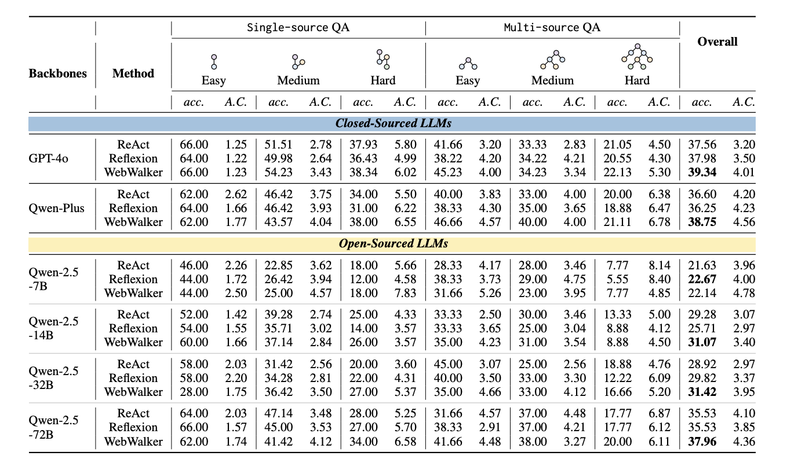
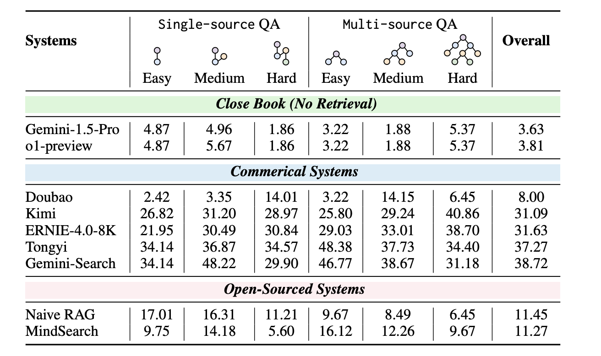

<div align="center">
<p align="center">
  
</p>
</div>

<div align="center">
<h1>WebWalker: Benchmarking LLMs in Web Traversal</h1>
</div>

<div align="center">
 


<!-- **Authors:** -->
<br>

_**Jialong Wu, Wenbiao Yin, Jiang Yong, Zhenglin Wang, Zekun Xi, Runnan Fang**_

_**Deyu Zhou, Pengjun Xie, Fei Huang<br>**_

<!-- **Affiliations:** -->

_Tongyi Lab, Alibaba Group_

Welcome to try web traversal via our **[online demo](https://www.modelscope.cn/studios/jialongwu/WebWalker/)**!

</div>

Repo for [_WebWalker: Benchmarking LLMs in Web Traversal_](https://arxiv.org/abs/2411.02937)

# 📖 Quick Start

- 🌏 The **Online Demo** is avaiable at [ModelScope](https://www.modelscope.cn/studios/jialongwu/WebWalker/) now！

- 🤗 The **WebWalkerQA** dataset is avaiable at[ HuggingFace Datasets]()!

- 🤗 The **WebWalkerQA** Leaderborad is avaiable at[ HuggingFace]()!


# 📌 Introduction

- We construct a challenging benchmark, **WebWalkerQA**, which is composed of 540 queries from four real-world scenarios across over 1580 webpages.
- To tackle the challenge of web-navigation tasks requiring long context, we propose **WebWalker**, which utilizes a multi-agent framework for effective memory management.
- Extensive experiments show that the WebWalkerQA is **challenging**, and for information-seeking tasks, **vertical exploration** within the page proves to be beneficial.

<div align="center">
    
</div>

# 📚 WebWalkerQA Dataset

The json item of WebWalkerQA dataset is organized in the following format:

```json
{
  "image_url": "https://www.pcarmarket.com/static/media/uploads/galleries/photos/uploads/galleries/22387-pasewark-1986-porsche-944/.thumbnails/IMG_7102.JPG.jpg/IMG_7102.JPG-tiny-2048x0-0.5x0.jpg",
  "question": "What is the model of car from this brand?",
  "question_id": "qid",
  "answer": ["保时捷 944", "Porsche 944."]
}
```

🤗 The WebWalkerQA Leaderboard is is avaiable at[ HuggingFace]()!

## 💡 Perfomance

### 📊 Result on Web Agents

The performance on Web Agents are shown below:

<div align="center">
    
</div>

### 📊 Result on RAG-Systems

<div align="center">
    
</div>

🤗 The WebWalkerQA Leaderboard is is avaiable at[ HuggingFace]()!

# 🛠 Dependencies

```bash
conda create -n webwalker python=3.10
git clone https://github.com/alibaba-nlp/WebWalker.git
cd WebWalker
pip install -e .
# Install requirements
pip install -r requirement.txt
# Run post-installation setup
crawl4ai-setup
# Verify your installation
crawl4ai-doctor
```

### 💻 Running WebWalker Demo Locally

Before running, please export the OPENAI API key 🔑 or Dashscope API key 🔑 as an environment variable:

```bash
export OPEN_AI_API_KEY=YOUR_API_KEY
export OPEN_AI_API_BASE_URL=YOUR_API_BASE_URL
```

or

```bash
export DASHSCOPE_API_KEY=YOUR_API_KEY
```

Then, run the `app.py` file with Streamlit:

```bash
cd src
streamlit run app.py
```

### Runing RAG-System on WebWalkerQA

```bash
cd src
python rag_system.py --model_name_or_path facebook/rag-token-nq
--output_file_path ../data/rag_output.jsonl
```

The details of experiment settings can be found in the readme file in the `src` folder.

# 🔍 Evaluation

The evaluation script for accuracy of the output answers using GPT-4o can be used as follows:

```bash
python evaluate.py --evaluate_file_path [path to output jsonl file]
```

## 🌻Acknowledgement

- This work is implemented by ReACT, Qwen-Agents, LangChain. Sincere thanks for their efforts.
- We sincerely thank the contributors and maintainers of [ai4crawl](https://github.com/unclecode/crawl4ai) for their open-source tool, which helped us get web pages in a Markdown-like format.
- The repo is contributed by [Jialong Wu](https://callanwu.github.io/), if you have any questions, please feel free to contact via jialongwu@alibaba-inc.com or jialongwu@seu.edu.cn.

## 🚩Citation

If this work is helpful, please kindly cite as:

```bigquery
@article{
}
```
