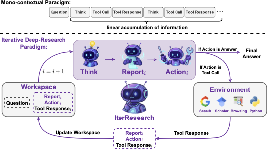
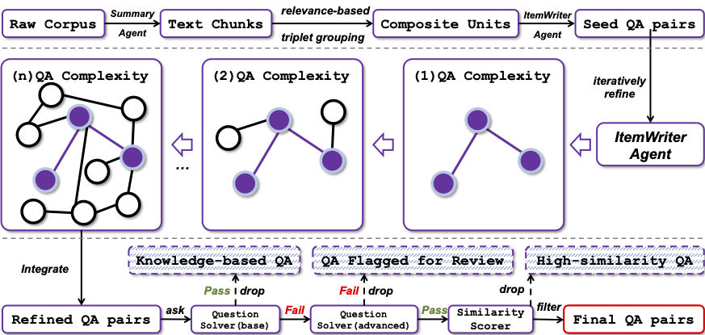
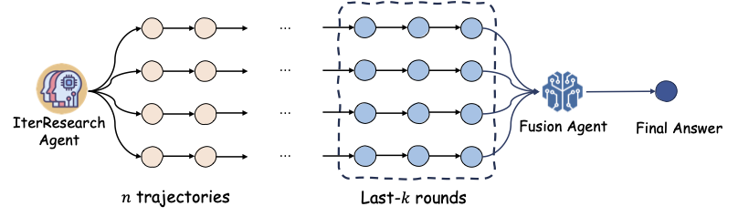

# WebResearcher: An Iterative Deep-Research Agent

<p align="center">
  <!-- Placeholder for a logo. You can replace this with your own logo. -->
  
</p>


[](https://arxiv.org/abs/2509.XXXXX) <!-- Placeholder link -->
[](https://github.com/Alibaba-NLP/WebAgent)


## 🥇 Introduction

- **WebResearcher** is an autonomous agent built upon a novel **Iterative Deep-Research Paradigm**. It is designed to emulate the sophisticated cognitive workflow of human experts, moving beyond simple information retrieval to autonomously deconstruct complex problems, orchestrate advanced tool use, and synthesize findings into coherent, evidence-grounded narratives.

- Current open-source research agents often rely on a **mono-contextual, linear accumulation** of information. This approach is fundamentally flawed, suffering from:
    1.  **Cognitive Workspace Suffocation:** An ever-expanding context window constrains the model's ability to perform deep, complex reasoning.
    2.  **Irreversible Noise Contamination:** Irrelevant information and early errors accumulate and dilute the context, propagating biases.
    3.  **Lack of Periodic Synthesis:** The linear process prevents the agent from pausing to distill, re-evaluate, and strategically plan its next steps.

- **WebResearcher** overcomes these limitations by deconstructing the research process into discrete rounds. In each round, the agent reasons over its current knowledge, synthesizes new insights into an evolving **summary report**, and then charts its course for the next action. This evolving report acts as the agent's central memory, ensuring a focused cognitive workspace and enabling sustained, high-quality reasoning and practically unbounded research depth.

- To fuel our agent, we developed a **Scalable Data Synthesis Engine** that programmatically generates large-scale, high-quality, HLE-style datasets. This data powers a specialized multi-stage training pipeline, including Rejection-based Fine-Tuning (RFT) and Reinforcement Learning with Verifiable Rewards (RLVR), to instill robust tool use and sharpen logical deduction.

- Published in the paper [WebResearcher](https://arxiv.org/abs/2509.XXXXX), WebResearcher sets a new standard for open-source research agents, demonstrating substantial gains over prior paradigms, particularly in complex reasoning tasks.

## 🚀 Performance Highlights

1.  **New State-of-the-Art on Complex Reasoning:** WebResearcher achieves exceptional performance on challenging benchmarks. On **HLE**, our 30B model scores **32.0**, significantly outperforming prior open-source and even many proprietary systems.

    <!-- <p align="center">
      
    </p> -->

2.  **Dominance Across General Web Search:** Evaluated on a suite of general web search benchmarks, **WebResearcher-30B** consistently outperforms much larger models, including WebSailor-72B and other strong baselines on benchmarks like GAIA, BrowseComp, and Xbench-DeepSearch. This highlights the superior efficiency and effectiveness of our iterative paradigm.

    <!-- <p align="center">
      
    </p> -->

3.  **Superior Scalability and Efficiency:** Our model, **WebResearcher-30B**, delivers an exceptional performance-to-efficiency trade-off. Despite being substantially smaller, it surpasses the performance of previous 72B-scale agents, demonstrating the power of our architecture and training methodology.

## 🔧 Quick Start

### Step 0: Set Up the Environment

```bash
conda create -n iter-research python=3.11
conda activate iter-research
pip install -r requirements.txt
```

### Step 1: Download the WebResearcher Model

You can download the WebResearcher models from Hugging Face:
- [🤗 WebResearcher-30B](https://huggingface.co/Alibaba-NLP/WebResearcher-30B) <!-- Placeholder link -->


You will also need the summary model used by the `Visit` tool:
- [🤗 Qwen2.5-72B-Instruct](https://huggingface.co/Qwen/Qwen2.5-72B-Instruct)

### Step 2: Prepare the Evaluation Datasets

Download the official benchmarks and place them in the `data/` folder, ensuring they follow the required JSONL format.
- `hle.jsonl`
- `gaia.jsonl`
- `browsecomp_en.jsonl`
- `browsecomp_zh.jsonl`
- `xbench_deepsearch.jsonl`
...and others.

### Step 3: Inference with Test-Time Scaling (TTS)

We provide an example script for evaluation at `scripts/test.sh`. Our inference process uses **Test-Time Scaling (TTS)** with `last-k-fusion`, where `n` parallel rollouts are generated and the final `k` steps of each are fed to a **Fusion Agent** to synthesize the final answer.

**Please update the script with your model paths and API keys.**

```bash
#!/bin/bash

# Specify model paths
AGENT_MODEL_PATH="/path/to/WebResearcher-30B"
SUMMARY_MODEL_PATH="/path/to/Qwen2.5-72B-Instruct"
FUSION_MODEL_PATH="/path/to/WebResearcher-30B" # Fusion agent can be the same as the agent

# Specify dataset and output
DATASET_NAME="gaia"
OUTPUT_DIR="results/gaia_results"

# API Keys for tools
# The agent uses Search (Google), Scholar, and Visit (Jina) tools
export GOOGLE_API_KEY="YOUR_GOOGLE_API_KEY"
export JINA_API_KEY="YOUR_JINA_API_KEY"

# Run inference with n=3 rollouts and k=2 last steps for fusion
python run_inference.py \
    --agent_model_path $AGENT_MODEL_PATH \
    --summary_model_path $SUMMARY_MODEL_PATH \
    --fusion_model_path $FUSION_MODEL_PATH \
    --dataset_path data/${DATASET_NAME}.jsonl \
    --output_dir $OUTPUT_DIR \
    --num_rollouts 3 \
    --fusion_last_k 2

# Run evaluation script on the generated results
python evaluate.py --results_file ${OUTPUT_DIR}/predictions.jsonl
```

## The WebResearcher Paradigm

### 1. The Iterative Deep-Research Paradigm

Instead of linearly accumulating information, WebResearcher deconstructs research into discrete rounds. Each round is powered by a lean, reconstructed **Workspace** and produces a structured response containing `Think`, `Report`, and `Action`.

-   **Think:** The agent's internal monologue for reasoning and planning. It is not passed to subsequent rounds to prevent clutter.
-   **Report:** The agent’s evolving central memory. It synthesizes new findings into a coherent, high-density summary that is carried forward to the next round.
-   **Action:** The final, machine-parseable decision, which is either a `Tool Call` (e.g., Search, Visit, Python) or the `Final Answer`.

This cyclical process of synthesis and reconstruction prevents cognitive suffocation and noise contamination, enabling sustained, deep reasoning.

<p align="center">
  
  <br>
  <em>Figure: Mono-contextual Paradigm (Top) vs. WebResearcher Paradigm (Bottom).</em>
</p>

### 2. Scalable Data Synthesis Engine

To overcome the data bottleneck for training advanced agents, we built a scalable data engine. This engine uses a multi-agent framework in a three-stage workflow to automatically generate large-scale, high-quality, and complex reasoning tasks.

1.  **Seed Data Generation:** An `ItemWriter` agent creates initial question-answer pairs from a curated corpus of documents.
2.  **Iterative Complexity Escalation:** The agent, now augmented with tools (Search, Scholar, Python), iteratively refines and expands the questions, increasing their intellectual depth and complexity.
3.  **Rigorous Quality Control:** A `QuestionSolver` agent and a `Judge` agent form a gauntlet to filter out simple questions, verify the correctness of complex ones, and ensure the final dataset is challenging and accurate.

<p align="center">
  
  <br>
  <em>Figure: The three-stage data synthesis workflow.</em>
</p>

### 3. Training and Inference

-   **Rejection Sampling Fine-Tuning (RFT):** We first fine-tune the base model on high-quality trajectories where the final answer exactly matches the ground truth. This instills robust tool-use competence and knowledge-grounded reasoning.
-   **Reinforcement Learning (RL):** We further sharpen the agent's multi-step logical deduction abilities using Reinforcement Learning with Verifiable Rewards (RLVR).
-   **Test-Time Scaling (TTS) with `last-k-fusion`:** At inference, we boost performance by running multiple parallel inference rollouts and using a dedicated **Fusion Agent** to synthesize the final answer from the most critical final steps of each trajectory.

<p align="center">
  
  <br>
  <em>Figure: Illustration of our `last-k-fusion` technique for Test-Time Scaling.</em>
</p>

## 🎥 Demos

⌛️ Demos showcasing WebResearcher's capabilities on complex research tasks will be released soon!

## 📑 Citation

If you find our work helpful, please kindly cite our paper:

```bibtex

```
