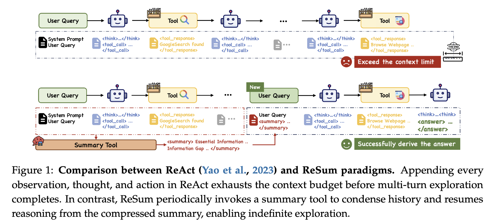

# ReSum: Unlocking Long-Horizon Search Intelligence via Context Summarization


## 🏅 Introduction



We introduce ReSum, a novel inference paradigm that enables **unlimited exploration** for web agents. Unlike classic ReAct paradigm that append all interaction history, ReSum periodically compresses conversation into compact, restartable reasoning states. Meanwhile, ReSum minimizes
modifications to ReAct to avoid additional architectural complexity, ensuring simplicity, efficiency, and plug-and-play compatibility with existing agents. Detailed contributions:

* **ReSumTool-30B** a specialized summarization model trained to extract key evidence, identify information gaps, and highlight next-step directions for continued exploration. This lightweight, open-source tool enables goal-oriented conversation compression tailored for web search contexts.
* **ReSum-GRPO** a tailored algorithm for paradigm adaptation. Specifically, ReSum-GRPO segments long trajectories and broadcasts trajectory-level advantages across all segments. Notably, with just 1K training samples, our ReSum-GRPO-trained WebSailor-30B-A3B achieves 33.3% Pass@1on BrowseComp-zh and 18.3% on BrowseComp-en, outperforming existing open-source web agents.


## 🚀 Performance Highlights 

1. **Universal Compatibility**: Direct application of the ReSum paradigm across three WebSailor agents achieves **4.5% average Pass@1 improvement**, demonstrating broad applicability.
2. **Specialized Summarization**: Our developed ReSumTool-30B achieves performance comparable to significantly larger models like Qwen3-235B and DeepSeek-R1-671B when serving as the summary tool, while maintaining lightweight deployment advantages.
3. **Effectiveness of Targeted RL Training**: The tailored ReSum-GRPO algorithm achieves higher training rewards and faster convergence compared to standard GRPO. Such paradigm-adapted reinforcement learning enables agents to reach **8.2% absolute improvement**.


## 📚 Citation 

If you find ReSum useful, please kindly cite as:

```bibtex
@article{wu2025resumun,
   title={ReSum: Unlocking Long-Horizon Search Intelligence via Context Summarization}, 
   author={Xixi Wu and Kuan Li and Yida Zhao and Liwen Zhang and Litu Ou and Huifeng Yin and Zhongwang Zhang and Yong Jiang and Pengjun Xie and Fei Huang and Minhao Cheng and Shuai Wang and Hong Cheng and Jingren Zhou},
   year={2025},
   journal={arXiv preprint arXiv:2509.13313},
}
```


