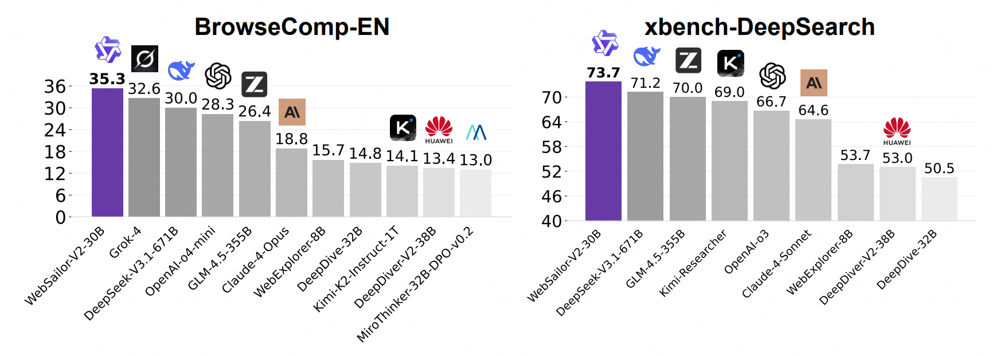

# WebSailor: Navigating Super-human Reasoning for Web Agent

<p align="center">
  
</p>


## 🥇 Introduction

- **WebSailor-V2** is the second version of [**WebSailor**](https://github.com/Alibaba-NLP/DeepResearch/tree/main/WebAgent/WebSailor)

- **WebSailor-V2**, a complete post-training pipeline encompassing data construction, Supervised Fine-Tuning (SFT), and Reinforcement Learning (RL). Our methodology features two key innovations: (1) On the data front, we developed SailorFog-QA-2, a novel dataset built from a densely interconnected knowledge graph that introduces a wide variety of uncertainties beyond simple obfuscation, fostering more sophisticated reasoning. (2) For training, we engineered a dual-environment RL framework, combining a high-fidelity simulator for rapid, low-cost algorithmic iteration with a robust, managed real-world environment for stable final policy training, all integrated within a symbiotic data-policy feedback loop. 

## 🚀 Performance Highlights

<p align="center">
  
</p>

Trained on the Qwen3-30B-A3B model, WebSailor-V2 achieves state-of-the-art results, scoring 35.3 on BrowseComp-EN, 44.1 on BrowseComp-ZH, and 30.6 on Humanity's Last Exam (HLE). Notably, our 30B-A3B MOE agent significantly outperforms all existing open-source agents and surpasses even the 671B DeepSeek-V3.1, demonstrating performance competitive with leading proprietary systems.


## Paper Link
**Arxiv**: [WebSailor-V2: Bridging the Chasm to Proprietary Agents via Synthetic Data and Scalable Reinforcement Learning](https://arxiv.org/abs/2509.13305)

**Hugging Face**: [🤗 HuggingFace](https://huggingface.co/papers/2509.13305)

## 📑 Citation

If this work is helpful, please kindly cite as:

```bigquery
@article{li2025websailor-v2,
  title={WebSailor-V2: Bridging the Chasm to Proprietary Agents via Synthetic Data and Scalable Reinforcement Learning},
  author={Kuan Li, Zhongwang Zhang, Huifeng Yin, Rui Ye, Yida Zhao, Liwen Zhang, Litu Ou, Dingchu Zhang, Xixi Wu, Jialong Wu, Xinyu Wang, Zile Qiao, Zhen Zhang, Yong Jiang, Pengjun Xie, Fei Huang, Jingren Zhou},
  journal={arXiv preprint arXiv:2509.13305},
  year={2025}
}
