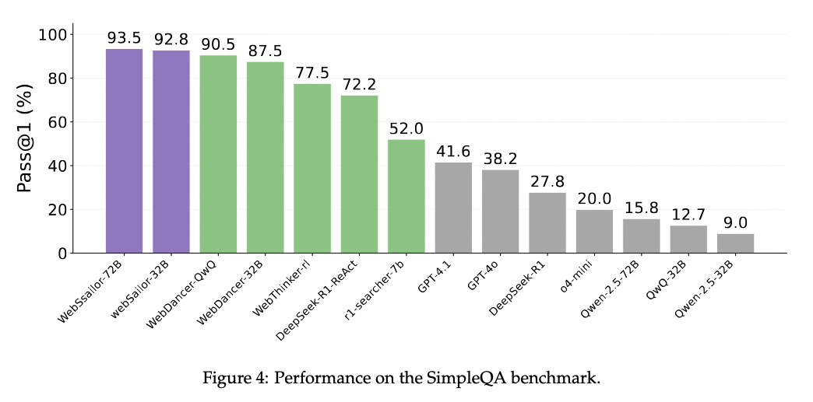
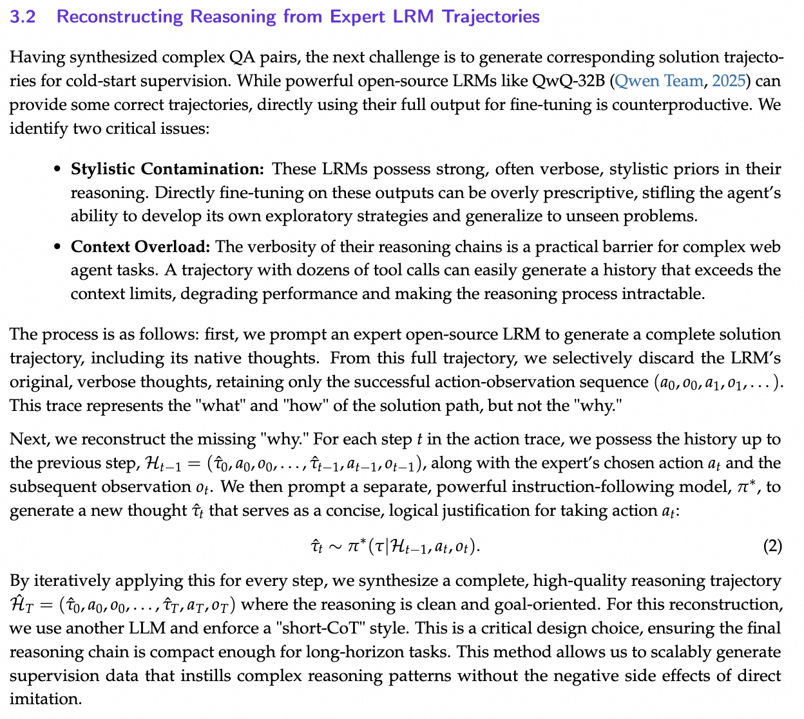

# WebSailor: Navigating Super-human Reasoning for Web Agent

<p align="center">
  
</p>


## 🥇 Introduction

- **WebSailor** is a complete post-training methodology designed to teach LLM agents sophisticated reasoning for complex web navigation and information-seeking tasks. It addresses the challenge of extreme uncertainty in vast information landscapes, a capability where previous open-source models lagged behind proprietary systems.

- We classify information-seeking tasks into three difficulty levels, where **Level 3** represents problems with both high uncertainty and a complex, non-linear path to a solution. To generate these challenging tasks, we introduce **SailorFog-QA**, a novel data synthesis pipeline that constructs intricate knowledge graphs and then applies information obfuscation. This process creates questions with high initial uncertainty that demand creative exploration and transcend simple, structured reasoning patterns.

- Our training process begins by generating expert trajectories and then reconstructing the reasoning to create concise, action-oriented supervision signals, avoiding the stylistic and verbosity issues of teacher models. The agent is first given a "cold start" using rejection sampling fine-tuning (RFT) on a small set of high-quality examples to establish a baseline capability. This is followed by an efficient agentic reinforcement learning stage using our **Duplicating Sampling Policy Optimization (DUPO)** algorithm, which refines the agent's exploratory strategies.

- WebSailor establishes a **new state-of-the-art for open-source agents**, achieving outstanding results on difficult benchmarks like BrowseComp-en and BrowseComp-zh. Notably, our smaller models like WebSailor-7B outperform agents built on much larger backbones, highlighting the efficacy of our training paradigm. Ultimately, WebSailor closes the performance gap to proprietary systems, achieving results on par with agents like Doubao-Search.

## 🚀 Performance Highlights

1. Evaluated on extremely difficult benchmarks including BrowseComp-en/zh, our 72B model consistently achieves the highest scores against strong baselines.
<p align="center">
  
</p>

2. A more comprehensive evaluation sees **WebSailor** emerges as the best open-source web agent, while being competitive against leading proprietary agents.
<p align="center">
  
</p>

3. Despite being trained on high-difficulty data, WebSailor generalizes well on simpler benchmarks like SimpleQA, where even the 32B results can surpass all baseline methods.
<p align="center">
  
</p>

## 🔧 Quick Start

### Step 0: Set Up the Environment

```bash
conda create -n websailor python=3.11
pip install -r requirements.txt
```

### Step 1: Download the WebSailor model

You can download WebSailor via Hugging Face [🤗 HuggingFace](https://huggingface.co/Alibaba-NLP/WebSailor-3B).

### Step 2: Prepare the Evaluation Datasets

Only a sample file `example.jsonl` remains in `src/eval_data/` to prevent test data leakage.  
Please download the following official benchmarks and save them in the same folder with the listed filenames, following the exact JSONL format of `example.jsonl`:

- `browsecomp_en.jsonl`
- `browsecomp_zh.jsonl`
- `gaia.jsonl`
- `xbench-deepsearch.jsonl`

### Step 3: Inference with tools

We provide an example script for evaluation at /src/scripts/test.sh.

This script will launch the local SGLang Server, including both the evaluation model and the summary model (currently Qwen2.5-72B-Instruct). It will then perform inference three times. Finally, the evaluation will be conducted based on the results of these three inferences. **Please specify the model path to be evaluated, the dataset name, and the output folder name.**

_You need to specify your Google search key and Jina key in the script._

## 🎥 Demos

We provide demos for BrowseComp-en, BrowseComp-zh and Daily Use. Our model can complete highly difficult and uncertain tasks requiring massive information acquisition and complex reasoning.

<div align="center">
    <h3>BrowseComp-en</h3>
    <video src= "https://github.com/user-attachments/assets/2dc0b03a-c241-4f70-bf11-92fda28020fa"/>
</div>

<div align="center">
    <h3>BrowseComp-zh</h3>
    <video src="https://github.com/user-attachments/assets/f9aed746-ffc8-4b76-b135-715ec0eab544" />
</div>

<div align="center">
    <h3>Daily Use</h3>
    <video src="https://github.com/user-attachments/assets/1299c5a8-cee3-4a70-b68b-c5d227cf8055" />
</div>

⌛️ The deployment of models and demos will be updated soon.

## Complete Training Paradigm

### 1. Browsing Data Construction

<p align="center">
  
</p>

Example SailorFog-QA data samples can be found at: [dataset/sailorfog-QA.jsonl](dataset/sailorfog-QA.jsonl)

### 2. Trajectory Sampling

<p align="center">
  
</p>

The sampled trajectory data will be released soon🔥🔥🔥

### 3. Reinforcement Learning

We propose **Duplicating Sampling Policy Optimization (DUPO)** to further train our model after the RFT cold-start stage. We use [verl](https://github.com/volcengine/verl) for RL training.


## 📑 Citation

If this work is helpful, please kindly cite as:

```bigquery
@article{li2025websailor,
  title={WebSailor: Navigating Super-human Reasoning for Web Agent},
  author={Li, Kuan and Zhang, Zhongwang and Yin, Huifeng and Zhang, Liwen and Ou, Litu and Wu, Jialong and Yin, Wenbiao and Li, Baixuan and Tao, Zhengwei and Wang, Xinyu and others},
  journal={arXiv preprint arXiv:2507.02592},
  year={2025}
}
