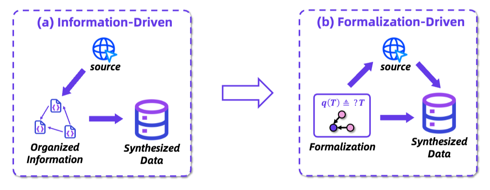

# WebShaper: Agentically Data Synthesizing via Information-Seeking Formalization

<p align="center">
  
</p>

<a href="https://arxiv.org/pdf/2507.15061"></a>

## 💡 Introduction

- We introduce **WebShaper**, a **`formalization-driven`** data synthesis method for information-seeking agents, grounded in our proposed task formalization. Leveraging this method, we construct the **WebShaper** dataset, which enables systematic generation of IS instances.
- We propose an agentic Expander that iteratively generates and validates questions in alignment with the formalization.
- We conduct extensive experiments across multiple benchmarks to evaluate the effectiveness of WebShaper. We achieve new state-of-the-art results on **GAIA** (**60.19**) and **WebWalkerQA** (**52.50**) benchmarks.

## Dataset

**WebShaper** is a dataset for training information-seeking agents, we release **500** questions-answer pairs in 🤗 [HuggingFace](https://huggingface.co/datasets/Alibaba-NLP/WebShaper) and  [ModelScope](https://modelscope.cn/datasets/iic/WebShaper).
You can access the dataset directly via [data/webshaper.500.jsonl](data/webshaper.500.jsonl).

Data fields:

- **id**: Unique id of each data.
- **question**: Synthesized question in natural language.
- **formalization**: formalization of the question in our list representation.
- **answer**: Answer for the question.
- **urls**: all urls for retrieved and used information for the question.

## 🚀 Performance

<p align="center">
  
</p>

## 🔍 WebShaper Features

### Information Seeking Task Formalization

<p align="center">
  
</p>

(a) Previous methods retrieve and organize collected information in advance, then synthesize data according to the information structures.
(b) Our method establishes the **task formalization** first, then collects information, and synthesizes QA data based on the formalization.

> Formalization:

<p align="center">
  
</p>

A formal question-answer case in our information-seeking formalization. We use the purple diagram to represent a knowledge projection, which is a set of entities. KP has two core operations: R-Union and intersection.

## Layer-wise Structure

<p align="center">
  
</p>

Structures on different expansion paradigms. (a) Random Structure denotes expanding by randomly adding constants. (b) Sequential Structure is expanding on a chain of reasoning sequence. (c) Layer-wise Structure traverses layer-wisely on leaf constants and replaces them with variables. `Target` stands for target variable. `Variable` means the intermediate variable. `Constant` is the constant in our KP representation.

## Case Study

<p align="center">
  
</p>

Compared with linear structure and sequential structure, our synthesized data has no problems of redundancy and reasoning shortcuts. The model should strictly seek information and reason alongside all the variables to find the answer. There are no constants directly connected to the target variable T or variables close to it. Besides, there are no constants connected to other constants.

Moreover, R-Union effects well in our data. The underlined FP is a summarization of distributed web contents, leading to more difficulty in resolving the variables K, N, and M. Benefiting from the formalization, our data contains a variety of IS forms, which can fully stimulate the different IS capabilities of the model.

## 📑 Citation

If this work is helpful, please kindly cite as:

```bigquery
@misc{tao2025webshaper,
      title={WebShaper: Agentically Data Synthesizing via Information-Seeking Formalization},
      author={Zhengwei Tao and Jialong Wu and Wenbiao Yin and Junkai Zhang and Baixuan Li and Haiyang Shen and Kuan Li and Liwen Zhang and Xinyu Wang and Yong Jiang and Pengjun Xie and Fei Huang and Jingren Zhou},
      year={2025},
      eprint={2507.15061},
      archivePrefix={arXiv},
      primaryClass={cs.CL},
      url={https://arxiv.org/abs/2507.15061},
}
```
