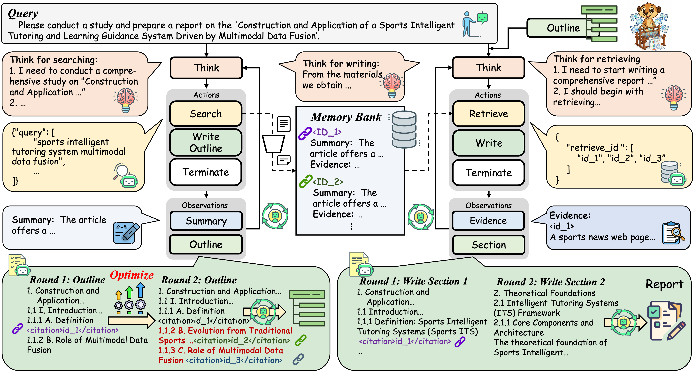
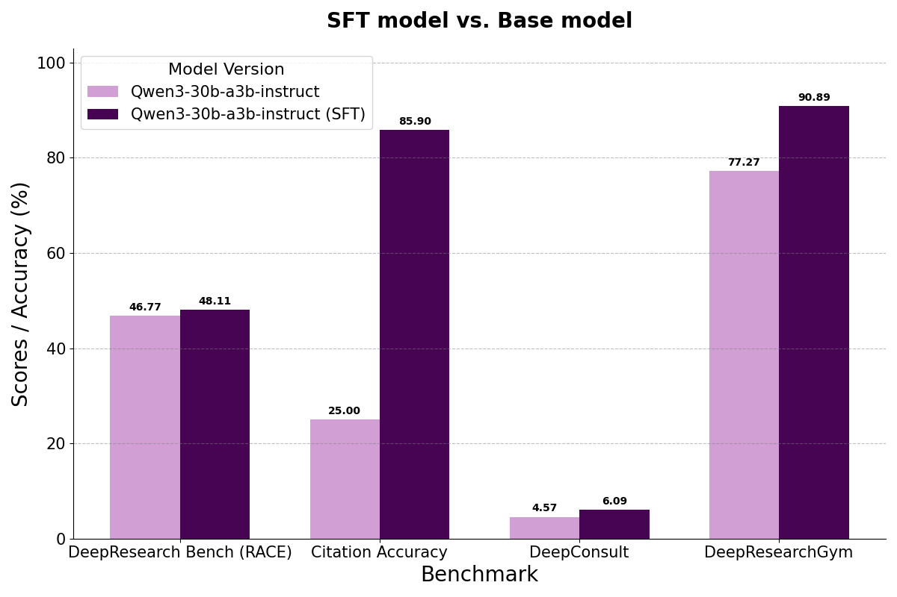

## WebWeaver: Structuring Web-Scale Evidence with Dynamic Outlines for Open-Ended Deep Research


Performance of varying deep research agents on DeepResearch Bench, DeepConsult, and DeepResearchGym. The results on DeepResearch Bench are taken from the official leaderboard. WebWeaver achieves state-of-the-art performance.




## 🎓Features

🤝🤖 **Human-Centric Dual-Agent Framework**: We introduce WebWeaver, a novel dual-agent framework that operationalizes the organic process of human research. By dividing labor between a planner (for exploration and outlining) and a writer (for synthesis), our system abandons rigid pipelines in favor of a more flexible and effective methodology.

🔄📚 **Dynamic Outline Optimization**: A core innovation is the agent's ability to treat the research outline as a "living document." Unlike static approaches, the planner operates in a continuous loop, interleaving web searches with outline refinement. This allows the research direction to evolve dynamically based on new discoveries, preventing "fossilization" and enabling genuine exploration.

🗂️🎯 **Memory-Grounded Hierarchical Synthesis**: To overcome the critical challenges of long-context limitations and "loss in the middle," the writer agent constructs the report section-by-section. For each part, it performs targeted retrieval from a curated memory bank, using only the most pertinent, pre-cited evidence. This ensures the final report is coherent, accurate, and deeply grounded in its sources.

🏆 **State-of-the-Art Performance on OEDR**: WebWeaver sets a new state-of-the-art by significantly outperforming existing proprietary and open-source agents on three challenging open-ended deep research benchmarks. This empirically validates that our human-inspired approach is more effective for tackling complex, open-ended knowledge work.

🌐🧠 **Democratizing Expertise with WebWeaver-3k**: To broaden the impact of our work, we create WebWeaver-3k, a high-quality supervised fine-tuning (SFT) dataset. Our experiments show that this dataset can distill the complex skills of our framework into smaller, more accessible models, enabling them to achieve expert-level research capabilities previously limited to large, proprietary systems.

## Performance Highlights


1. Detailed Performance of agents on DeepResearch Bench in terms of comprehensiveness (Comp.), insight, instruction-following (Inst.), readability (Read.), effective citations (Eff. c.), and citation accuracy (C. acc.). WebWeaver outperforms all other agent systems on most of the metrics.


<p align="center">
  
</p>

2. WebWeaver-3k enables a small model to achieve expert-level performance. 


<p align="center">
  
</p>

## 📑 Citation

If this work is helpful, please kindly cite as:
```bibtex
@misc{li2025webweaverstructuringwebscaleevidence,
      title={WebWeaver: Structuring Web-Scale Evidence with Dynamic Outlines for Open-Ended Deep Research}, 
      author={Zijian Li and Xin Guan and Bo Zhang and Shen Huang and Houquan Zhou and Shaopeng Lai and Ming Yan and Yong Jiang and Pengjun Xie and Fei Huang and Jun Zhang and Jingren Zhou},
      year={2025},
      eprint={2509.13312},
      archivePrefix={arXiv},
      primaryClass={cs.CL},
      url={https://arxiv.org/abs/2509.13312}, 
}
```