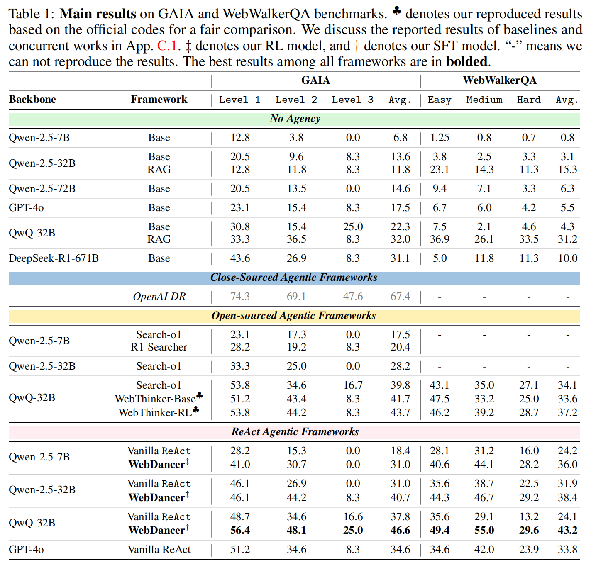

# WebDancer: Towards Autonomous Information Seeking Agency

  

## 🕺 Introduction

- We propose **WebDancer**, a novel end-to-end agentic training framework designed to enhance the multi-step information-seeking capabilities of web-based agents.
- We introduce a four-stage training paradigm comprising **browsing data construction, trajectory sampling, supervised fine-tuning for effective cold start, and reinforcement learning for improved generalization**, enabling the agent to autonomously acquire robust search and reasoning skills.
- Our data-centric approach integrates trajectory-level supervision and online learning to develop a scalable pipeline for **training agentic systems**.
- We instantiate this framework in a ReAct-based agent and conduct extensive experiments on **GAIA** and **WebWalkerQA** benchmarks. Results demonstrate that WebDancer achieves strong performance across diverse tasks, validating the effectiveness of our proposed paradigm and providing systematic insights for future agent development.

## Four-Stage Training Paradigm

### 1. Browsing Data Construction

  

### 2. Trajectory Sampling

  

### 3. Supervised Fine-Tuning

### 4. Reinforcement Learning

## 🚀 Performance

  

## 🤩 Acknowledgements

This work is implemented based on [LLaMA-Factory](https://github.com/hiyouga/LLaMA-Factory) and [verl](https://github.com/volcengine/verl).
We greatly appreciate their valuable contributions to the community, especially for [WebThinker](https://github.com/RUC-NLPIR/WebThinker).

## 📑 Citation
