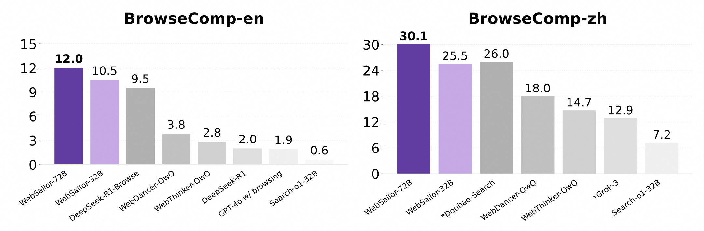
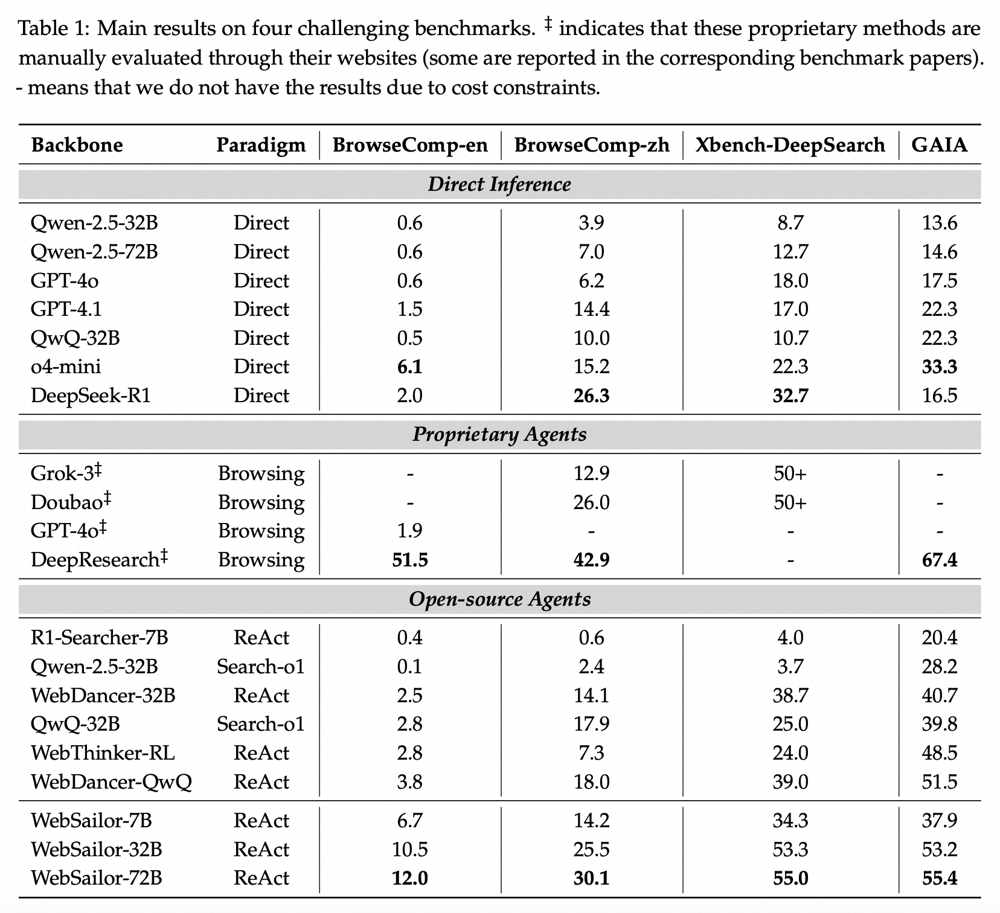
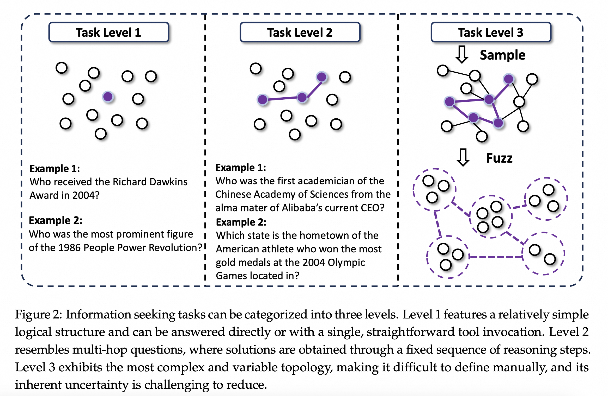

# WebSailor: Navigating Super-human Reasoning for Web Agent

  

## 🥇 Introduction

- **WebSailor** is a complete post-training methodology designed to teach LLM agents sophisticated reasoning for complex web navigation and information-seeking tasks. It addresses the challenge of extreme uncertainty in vast information landscapes, a capability where previous open-source models lagged behind proprietary systems.

- We classify information-seeking tasks into three difficulty levels, where **Level 3** represents problems with both high uncertainty and a complex, non-linear path to a solution. To generate these challenging tasks, we introduce **SailorFog-QA**, a novel data synthesis pipeline that constructs intricate knowledge graphs and then applies information obfuscation. This process creates questions with high initial uncertainty that demand creative exploration and transcend simple, structured reasoning patterns.

- Our training process begins by generating expert trajectories and then reconstructing the reasoning to create concise, action-oriented supervision signals, avoiding the stylistic and verbosity issues of teacher models. The agent is first given a "cold start" using rejection sampling fine-tuning (RFT) on a small set of high-quality examples to establish a baseline capability. This is followed by an efficient agentic reinforcement learning stage using our **Duplicating Sampling Policy Optimization (DUPO)** algorithm, which refines the agent's exploratory strategies.

- WebSailor establishes a **new state-of-the-art for open-source agents**, achieving outstanding results on difficult benchmarks like BrowseComp-en and BrowseComp-zh. Notably, our smaller models like WebSailor-7B outperform agents built on much larger backbones, highlighting the efficacy of our training paradigm. Ultimately, WebSailor closes the performance gap to proprietary systems, achieving results on par with agents like Doubao-Search.

## 🚀 Performance Highlights

1. Evaluated on extremely difficult benchmarks including BrowseComp-en/zh, our 72B model consistently achieves the highest scores against strong baselines.

  

2. A more comprehensive evaluation sees **WebSailor** emerges as the best open-source web agent, while being competitive against leading proprietary agents.

  

3. Despite being trained on high-difficulty data, WebSailor generalizes well on simpler benchmarks like SimpleQA, where even the 32B results can surpass all baseline methods.

  

## 🔧 Quick Start

Details of how to run Websailor will come soon🔥🔥🔥

## 🎥 Demos

We provide demos for BrowseComp-en, BrowseComp-zh and Daily Use. Our model can complete highly difficult and uncertain tasks requiring massive information acquisition and complex reasoning.

    <h3>BrowseComp-en</h3>
    <video src="./assets/bc_en.mp4" />

    <h3>BrowseComp-zh</h3>
    <video src="./assets/bc_zh.mp4" />

    <h3>Daily Use</h3>
    <video src="./assets/daily.mp4" />

⌛️ The deployment of models and demos will be updated soon.

## Complete Training Paradigm

### 1. Browsing Data Construction

  

The sampled QA data will be released soon🔥🔥🔥

### 2. Trajectory Sampling

  

The sampled trajectory data will be released soon🔥🔥🔥

### 3. Reinforcement Learning

We propose **Duplicating Sampling Policy Optimization (DUPO)** to further train our model after the RFT cold-start stage. We use [verl](https://github.com/volcengine/verl) for RL training.
