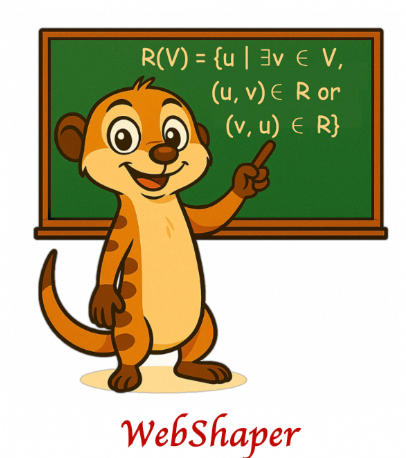
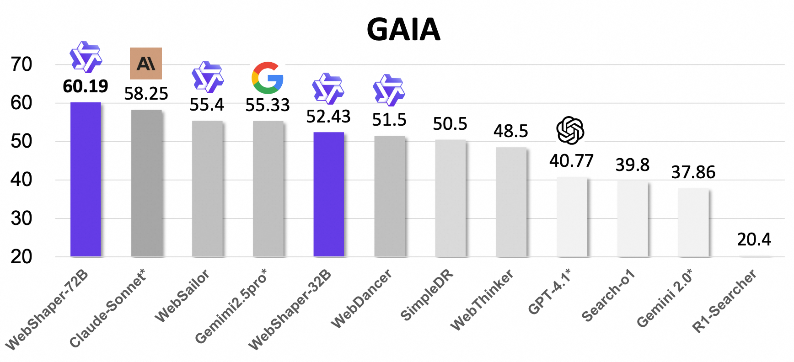
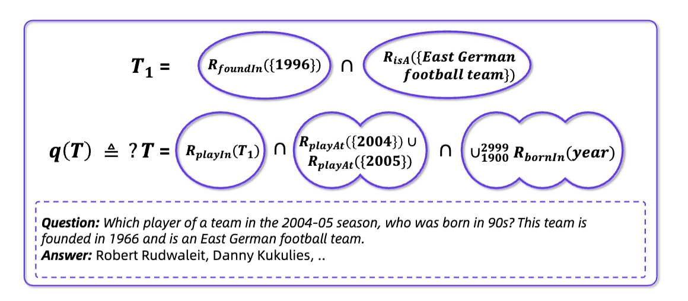
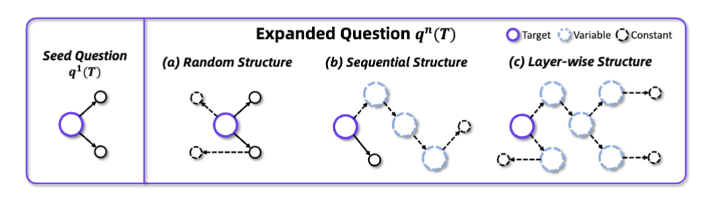

# WebDancer: Towards Autonomous Information Seeking Agency

<p align="center">
  
</p>

<a href="https://arxiv.org/pdf/xxx"></a>

## 💡 Introduction

- We introduce **WebShaper**, a **`formalization-driven`** data synthesis method for information-seeking agents, grounded in our proposed task formalization. Leveraging this method, we construct the **WebShaper** dataset, which enables systematic generation of IS instances.
- We propose an agentic Expander that iteratively generates and validates questions in alignment with the formalization.
- We conduct extensive experiments across multiple benchmarks to evaluate the effectiveness of WebShaper. We achieve new state-of-the-art results on **GAIA** (**60.19**) and **WebWalkerQA** (**52.50**) benchmarks.

## Dataset

**WebShaper** is a dataset for training information-seeking agents, we release **500** questions-answer pairs in 🤗 [HuggingFace](https://huggingface.co/datasets/Alibaba-NLP/WebShaper) and  [ModelScope](https://modelscope.cn/datasets/iic/WebShaper).

Data fields:

- **id**: Unique id of each data.
- **question**: Synthesized question in natural language.
- **formalization**: formalization of the question in our list representation.
- **answer**: Answer for the question.
- **urls**: all urls for retrieved and used information for the question.

## 🚀 Performance

<p align="center">
  
</p>

## 🔍 WebShaper Features

### Information Seeking Task Formalization

<p align="center">
  
</p>

(a) Previous methods retrieve and organize collected information in advance, then synthesize data according to the information structures.
(b) Our method establishes the **task formalization** first, then collects information, and synthesizes QA data based on the formalization.

> Case Study:

<p align="center">
  
</p>

A question-answer case in our information-seeking formalization. We use the purple diagram to represent a knowledge projection, which is a set of entities.

## Layer-wise Structure

<p align="center">
  
</p>

Structures on different expansion paradigms. (a) Random Structure denotes expanding by randomly adding constants. (b) Sequential Structure is expanding on a chain of reasoning sequence. (c) Layer-wise Structure traverses layer-wisely on leaf constants and replaces them with variables. `Target` stands for target variable. `Variable` means the intermediate variable. `Constant` is the constant in our KP representation.

<!-- ## 📑 Citation

If this work is helpful, please kindly cite as:

```bigquery
@article{li2025websailor,
  title={WebSailor: Navigating Super-human Reasoning for Web Agent},
  author={Li, Kuan and Zhang, Zhongwang and Yin, Huifeng and Zhang, Liwen and Ou, Litu and Wu, Jialong and Yin, Wenbiao and Li, Baixuan and Tao, Zhengwei and Wang, Xinyu and others},
  journal={arXiv preprint arXiv:2507.02592},
  year={2025}
}
``` -->
